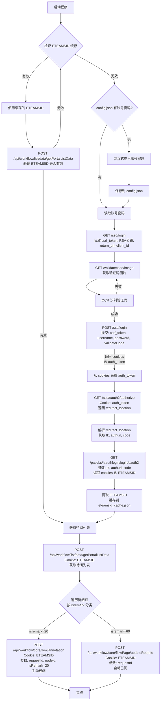

# newoa

OA待阅自动处理工具

## 功能

- 自动登录 SSO 系统
- 自动处理 OA 待阅任务
  - 手动已阅（isremark=20）
  - 自动已阅（isremark=60）
- ETEAMSID 本地缓存，避免重复登录

## 环境

- Python 3.8+
- Windows/Linux/macOS

## 安装

```bash
pip install -r requirements.txt
```

如果需要通过代理安装（如使用 Clash、V2Ray 等）：

```bash
pip install -r requirements.txt --proxy http://127.0.0.1:7890
```

或指定代理端口：

```bash
pip install ddddocr --proxy http://127.0.0.1:你的代理端口
```

## 配置

首次运行时会提示输入用户名和密码，配置会自动保存到 `config.json`。

也可以手动编辑 `config.json`：

```json
{
    "username": "你的用户名",
    "password": "你的密码"
}
```

## 运行

```bash
python main.py
```

## 流程说明

1. 检查本地缓存的 ETEAMSID 是否有效
2. 无效则使用账号密码登录 SSO（自动识别验证码）
3. 获取 ETEAMSID 并缓存到本地
4. 获取待阅列表并自动处理

### 流程图



### 数据传递说明

| 步骤 | API 端点 | 获取数据 | 用于下一步 |
|------|----------|----------|------------|
| 1 | GET /sso/login | csrf_token, public_key, return_url, client_id | 登录参数 |
| 2 | GET /validatecode/image | 验证码图片 | OCR 识别 |
| 3 | POST /sso/login | cookies (含 auth_token) | OAuth2 授权 |
| 4 | GET /sso/oauth2/authorize | redirect_location (含 tk, code) | 获取 ETEAMSID |
| 5 | GET /papi/bs/iaauthlogin/login/oauth2 | cookies (含 ETEAMSID) | API 请求凭证 |
| 6 | POST /api/workflow/list/data/getPortalListData | 待阅列表 data[] | 分类处理 |
| 7 | POST /flow/annotation | 处理结果 | 完成手动已阅 |
| 8 | POST /flowPage/updateReqInfo | 处理结果 | 完成自动已阅 |

## 验证码识别

使用 [ddddocr](https://github.com/kan련/ddddocr) 自动识别验证码，支持常见的字母数字组合验证码。

如遇识别失败，可查看同目录下的 `validate_code.png` 图片人工确认。

## 依赖

- requests
- pycryptodome
- beautifulsoup4
- selenium
- ddddocr
